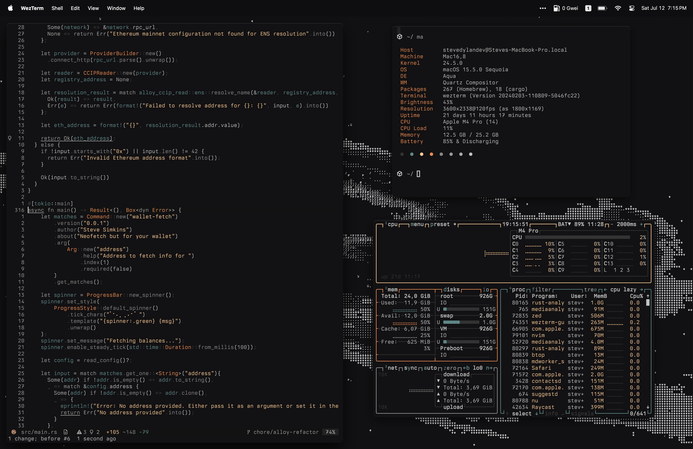

# Dotfiles

A collection of MacOS dotfiles I use in my developement environment

## Installation

To manage dotfiles I use a tool called [fling](https://github.com/bbkane/fling), which is similar to stow but in my opinion a bit more clear and fool proof. If you with to use fling to manage these dotfiles, all you have to do is the following:

1. Clone the dotfiles to your machine and `cd` into the directory
2. Make an empty directory where you want the files to be synced. e.g., `nvim` would be `mkdir -p ~/.config/nvim`
3. Run the fling command to make a symlink: `fling link -s nvim -l ~/.config/nvim`

This will ask you to confirm the decision and create the symlink. Any time you edit your dot files the changes will actually happen in ~/dotfiles making it easier to manage them with git.

If you don't wish to use fling you can simply copy and paste these as you wish.

## Features

- Custom theme which I've named "Darkmatter" exists in the [wezterm](wezterm/.wezterm.lua), [ghostty](ghostty/config), [nushell](nushell/darkmatter.nu), [nvim](https://github.com/stevedylandev/darkmatter-nvim), and [zed](https://github.com/stevedylandev/darkmatter-zed).
- A patched version of [Commit Mono](https://commitmono.com) which includes nerd fonts
- Custom prompt made with [starship](starship/starship.toml)
- Brewfile and cargofile with most of my packages (I update occasionally)

## Questions

Feel free to [reach out](mailto:hello@stevedylan.dev) if you have any questions! I'm always more than willing to help fellow terminal nerds like me :)
